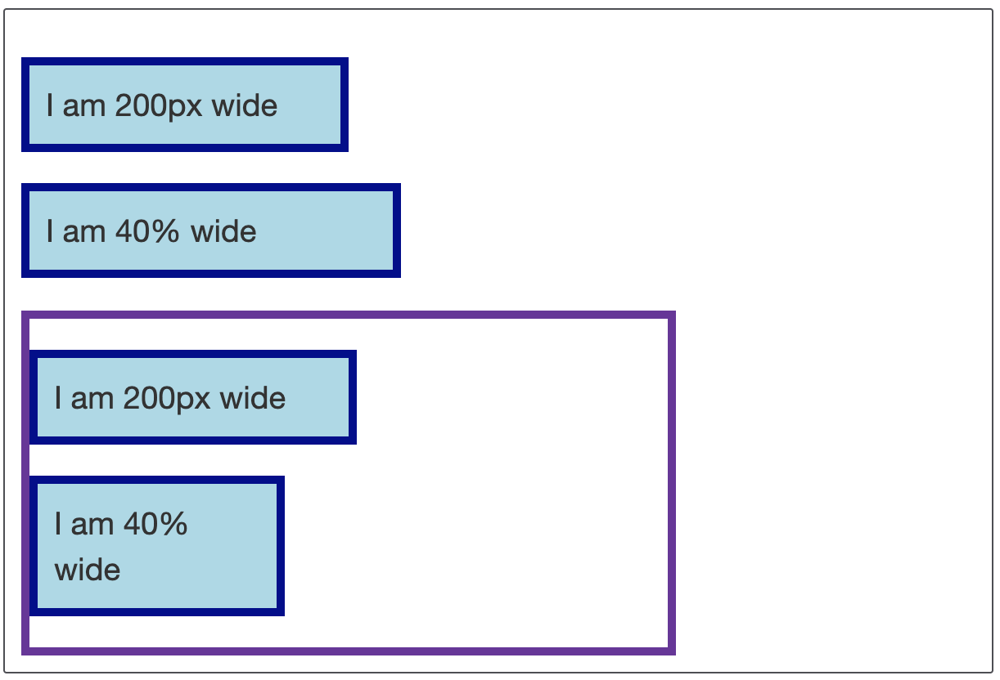

[>>>上一篇：CSS 伪类](../../lib/CSS/CSS伪类.md)

## CSS值与单位
---
CSS中使用的每个属性都允许拥有一个或一组值。   
CSS 有几个不同的单位用于表示长度。  
长度有一个数字和单位组成如 10px, 2em, 等。  

### 值
CSS元素 属性中的值常见的有以下这些：
- **颜色的数值表示**（详见下一章节）
- **长度**  
  >一些设置 CSS 长度的属性有 width, margin, padding, font-size, border-width, 等。  
长度有一个数字和单位组成如 10px, 2em, 等。  
数字与单位之间不能出现空格。如果长度值为 0，则可以省略单位。  
对于一些 CSS 属性，长度可以是负数。  

  - **绝对长度**  
    >由数字和绝对长度单位组成。在不同的设备中浏览，都是统一的长度。

  - **相对长度**  
    >由数字和相对长度单位组成。会根据不同设备中的像素，根元素的字体大小，屏幕大小而定。  
  (详见**单位**部分的解说)

- **百分比**  
  >百分比的问题在于，它们总是相对于其他值设置的。例如，如果将元素的字体大小设置为百分比，那么它将是元素父元素字体大小的百分比。如果使用百分比作为宽度值，那么它将是父值宽度的百分比。  
  在下面的示例中，两个百分比大小的框和两个像素大小的框具有相同的类名。这两款相机分别为200px和40%宽。  
  不同之处在于，第二组两个框位于一个400像素宽的包装器中。第二个200px宽的盒子和第一个一样宽，但是第二个40%的盒子现在是400px的40%——比第一个窄多了!  
    

  ```
  .wrapper {
  width: 400px;
  border: 5px solid rebeccapurple;
  }
  .px {
    width: 200px;
  }
  .percent {
    width: 40%;
  }
  ```
  ```
  <div class="box px">I am 200px wide</div>
  <div class="box percent">I am 40% wide</div>
  <div class="wrapper">
  <div class="box px">I am 200px wide</div>
  <div class="box percent">I am 40% wide</div>
  </div>
  ```
- **数字**  
  也有一些元素的属性不需要单位，只要数字就能表示的状态。例如透明度：`opacity=1`


### 单位
关于单位的说明可以通过以下链接了解  
[>>菜鸟教程__CSS单位](https://www.runoob.com/cssref/css-units.html)

最常用的单位类型有`px`，`em`，`rem`  
1. **px (pixel，像素)：**  
  px像素（Pixel）。相对长度单位。**像素点px**是相对于显示器屏幕分辨率而言的。
1. **em：**  
  是一个相对长度单位，相对于当前对象内文本的字体尺寸。**最初是指字母M的宽度，故名em。**现指的是字符宽度的倍数，用法类似百分比，如：0.8em, 1.2em,2em等。通常1em=16px。
1. **rem(root em，根em)：**  
这个单位与em有什么区别呢？  
区别在于使用rem为元素设定字体大小时，仍然是相对大小，但相对的只是HTML根元素。  
这个单位可谓集相对大小和绝对大小的优点于一身，通过它既可以做到**只修改根元素**就能成比例地调整所有字体大小，又可以避免字体大小逐层复合的连锁反应。

[>>>下一篇：CSS 颜色](../../lib/CSS/CSS颜色.md)
