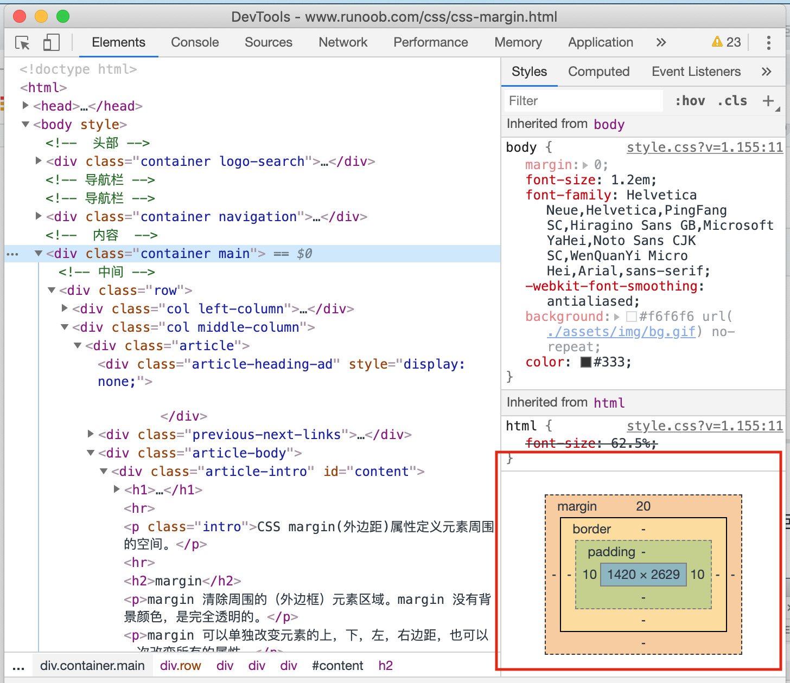

[>>>上一篇：CSS 颜色](../../lib/CSS/CSS颜色.md)

## CSS内外边距
---
### 边距
任何标签被浏览器渲染的时候，都有默认的外边距，边框和内边距，三个基础的属性。
通过F12(开发者调试工具)可以看到。

  

- 内边距： 边框于内容之间的距离。
- 外边距：边框于边框之间的距离。

  

### 外边距Margin
margin 没有背景颜色，是完全透明的。margin通过使用单独的属性，可以对上、右、下、左的外边距进行设置。即：
- margin-top
- margin-right
- margin-bottom
- margin-left

**实例：**
```
h1 {
  margin-top:10px;
  margin-right:15px;
  margin-bottom:20px;
  margin-left:25px;
}

//也可以依据顺时针写作:
margin: {上 右 下 左};
h1 {
  margin: {10px 15px 20px 25px};
}
```

margin属性除了上述的四个值，还可以设置一到三个值。
> 一个值
```
//所有的4个边距都是10px
margin:10px;
```
> 两个值
```
//上下边距为10px
//左右边距为25px
margin:10px 25px;
```
> 三个值
```
//上边距为10px
//左右边距为25px
//下边距为30px
margin:10px 25px 30px;
```

设置外边距的最简单的方法就是使用 margin 属性，这个属性接受任何长度单位、百分数值甚至负值。

### 内边距padding
padding和margin 同理，但表示元素在边框和内容区之间的距离。也可以通过使用下面四个单独的属性，分别设置上、右、下、左内边距：
- padding-top
- padding-right
- padding-bottom
- padding-left

亦或通过padding属性定义元素的内边距。padding 属性接受长度值或百分比值，但不允许使用负值。

padding和margin一样可以设置一到四个值，规则同理。

[>>>下一篇：CSS 定位](../../lib/CSS/CSS定位.md)
