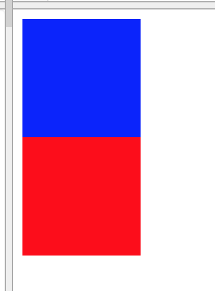
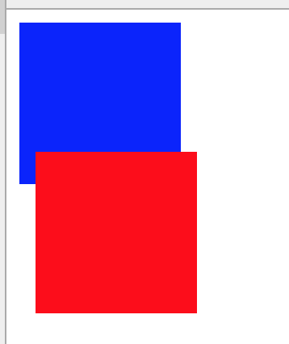
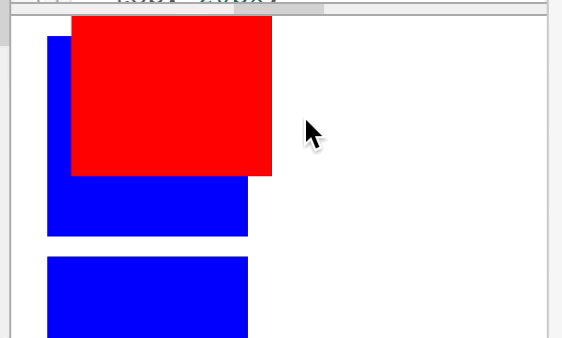
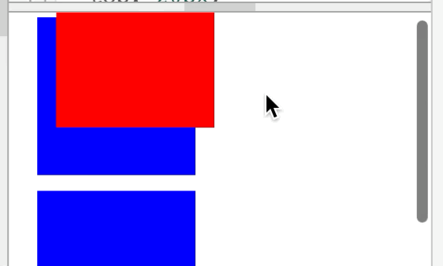
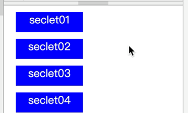

[>>>上一篇：CSS 内外边距](../../lib/CSS/CSS内外边距.md)

## CSS定位(position)
---
最初认识**定位**，可以查看以下链接    
[>>菜鸟__CSS Position(定位)](https://www.runoob.com/css/css-positioning.html)  

  

之前提到过**一个没有用任何CSS来改变页面布局的网页，那么网页元素就会排列在一个正常流（normal flow）**,从左往右，从上到下的排列。  
当正常排列无法满足的时候，就要通过定位(position)的方式，使其元素浮动或固定到目标区域。

position属性用来指定一个元素在网页上的位置，一共有5种定位方式，即position属性主要有五个值。
- static
- relative
- fixed
- absolute
- sticky
---
### static  
  - *静态定位*：默认值。没有定位，元素出现在正常的流中（忽略 top, bottom, left, right 或者 z-index 声明）。
  ```
  .pst1 {
    background-color:blue;
    height:100px;
    width:100px;
    position:static;
  }
  .pst2 {
    background-color:red;
    height:100px;
    width:100px;
    position:static;
  }
  ```
  ```
  <div class="pst1">
  </div>
  <div class="pst2">
  </div>
  ```
  运行结果如下：  

    

  正常排列

### relative  
  - *相对定位*：生成相对定位的元素，通过**top,bottom,left,right**的设置相对于其正常（原先本身）位置进行定位。可通过z-index进行层次分级。　
  ```
  .pst1 {
    background-color:blue;
    height:100px;
    width:100px;
    position:static;
  }
  .pst2 {
    background-color:red;
    height:100px;
    width:100px;
    position:relative;
    left:10px;
    top:-20px;
  }
  ```
  ```
  <div class="pst1">
  </div>
  <div class="pst2">
  </div>
  ```
  运行结果如下：  

    

  可以看到`pst2`采用了relative属性，并指定了`left:10px;top:20px;`值后，相对于上一个元属，向下偏移了-20像素点，向右偏移了10像素点。并会随着滚动条移动。

### fixed  
  - *固定定位*：生成绝对定位的元素，相对于浏览器窗口进行定位。元素的位置通过 **"left", "top", "right" 以及 "bottom"** 属性进行规定。可通过z-index进行层次分级。
  ```
  .pst1 {
    background-color:blue;
    height:100px;
    width:100px;
    position:static;
    margin:10px;
  }
  .pst2 {
    background-color:red;
    height:100px;
    width:100px;
    position:fixed;
    left:30px;
    top:-20px;
  }
  ```
  ```
  <div class="pst1">
  </div>
  <div class="pst1">
  </div>
  <div class="pst1">
  </div>
  <div class="pst1">
  </div>
  <div class="pst2">
  </div>
  ```
  运行结果如下：  

    

  可以看到pst2采用了fixed属性，并指定了left:30px;top:20px;值后，相对于根元属(即浏览器窗口)，向下偏移了-20像素点，向右偏移了30像素点。
  并且不会随着滚动条移动。

### absolute  
  - *绝对定位*：生成绝对定位的元素，相对于 static 定位以外的第一个父元素进行定位。元素的位置通过 **"left", "top", "right" 以及 "bottom"** 属性进行规定。可通过z-index进行层次分级。
  ```
  .pst1 {
    background-color:blue;
    height:100px;
    width:100px;
    position:static;
    margin:10px;
  }
  .pst2 {
    background-color:red;
    height:100px;
    width:100px;
    position:absolute;
    left:30px;
    top:-20px;
  }
  ```
  ```
  <div class="pst1">
  </div>
  <div class="pst1">
  </div>
  <div class="pst1">
  </div>
  <div class="pst1">
  </div>
  <div class="pst2">
  </div>
  ```
  运行结果如下：  

    

  可以看到pst2采用了fixed属性，并指定了left:30px;top:20px;值后，相对于根元属(即浏览器窗口)，向下偏移了-20像素点，向右偏移了30像素点。
  并且会随着滚动条移动。

### sticky  
- 这是一个结合了 position:relative 和 position:fixed 两种定位功能于一体的特殊定位，适用于一些特殊场景。先来看一下下面的实例
```
.pst1 {
  text-align: center;
  color:white;
  background-color:blue;
  height:30px;
  width:100px;
  position:sticky;
  margin:10px;
  top:10px;
}
```
```
<div class="pst1">
  seclet01
</div>
<div class="pst1">
  seclet02
</div>
<div class="pst1">
  seclet03
</div>
<div class="pst1">
  seclet04
</div>
<div class="pst1">
  seclet05
</div>
<div class="pst1">
  seclet06
</div>
<div class="pst1">
  seclet07
</div>
<div class="pst1">
  seclet08
</div>
<div class="pst1">
  seclet09
</div>
<div class="pst1">
  seclet10
</div>
<div class="pst1">
  seclet01
</div>
<div class="pst1">
  seclet02
</div>
<div class="pst1">
  seclet03
</div>
<div class="pst1">
  seclet04
</div>
```
运行结果如下：  

  

因为设定的阈值是 top:10px ，这个值表示当元素距离页面视口（Viewport，也就是fixed定位的参照）顶部距离大于 10px 时，元素以 relative 定位表现，而当元素距离页面视口小于 10px 时，元素表现为 fixed 定位，也就会固定在顶部。

不理解可以再看看下面这两张示意图（top:20px 的情况，取自开源项目fixed-sticky）：
**距离页面顶部大于20px，表现为 `position:relative`;**  
  

**距离页面顶部小于20px，表现为 `position:fixed`;**  
  

  >※z-index是层级属性。  
  ```
  //z-index:层数;
  h1 {
    z-index:1;
  }
  h2 {
    z-index:3;
  }
  ```
  当元素之间重叠的时候， z-index 较大的元素会覆盖较小的元素在上层进行显示。  
  即：当h1和h2重叠的时候，h2会将h1覆盖。

HTML/CSS/JS 在线工具https://c.runoob.com/front-end/61

具体进阶了解，可以参考以下的文章。  
[>>阮一峰的网络日志・CSS 定位详解](https://www.ruanyifeng.com/blog/2019/11/css-position.html)

[>>>下一篇：CSS 问题分析思路](../../lib/CSS/CSS问题分析思路.md)
