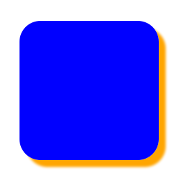
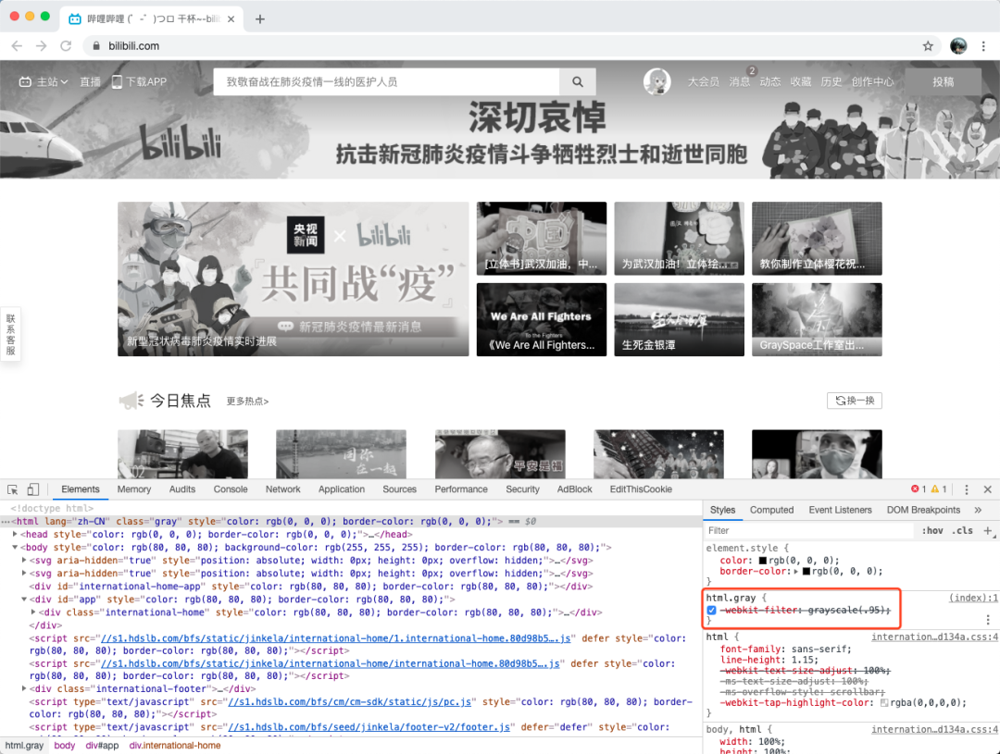

[>>>上一篇：CSS 值与单位](../../lib/CSS/CSS值与单位.md)

## CSS颜色
---
#### 具体颜色
颜色属性可以被用来设置文字的颜色，边框的颜色，背景的颜色等。
- 文本颜色:color
- 边框颜色:border-color
- 背景颜色:background-color

颜色是通过CSS最经常的指定：

- 十六进制值 - 如: ＃FF0000
- 一个RGB值 - 如: RGB(255,0,0)※除了IE，其他浏览器几乎都支持RGB函数。
- 颜色的名称 - 如: red  

参阅 [>>CSS 颜色值](https://www.runoob.com/cssref/css-colors.html) 查看完整的颜色值。  
一个网页的背景颜色是指在主体内的选择：
```
//十六进制值
h1 {color:#00ff00;}
//RGB值
h2 {color:rgb(255,0,0);}
//名称
body {color:red;}
```
#### 透明颜色
默认HTML文本的颜色是白底黑字，当给其设定一个颜色的时候，也都是默认不透明的。

**实现透明度的方法：**
- css3的**opacity:x**，x 的取值从 0 到 1，如**opacity: 0.8**
- css3的**rgba(red, green, blue, alpha)**，**alpha**的取值从 0 到 1，如**rgba(255,255,255,0.8)**

```
h1:{
  background-color: yellow;
  /* 完全不透明 */
  opacity: 1;
  opacity: 1.0;

  /* 半透明 */
  opacity: 0.6;

  /* 完全透明 */
  opacity: 0.0;
  opacity: 0;
}

div:{background-color: rgba(255,255,255,0.8);}
```
>##### 特殊情况：
> - **background:transparent;**  
>
>  透明背景，也就是去掉了被如果一个元素覆盖在另外一个元素之上，而你想显示下面的元素，这时你就需要把上面这个元素的background设置为transparent  
>
>    

#### 盒状阴影
`box-shadow` 属性用于在元素的框架上添加阴影效果
```
box-shadow: x轴偏移值 y轴偏移值 阴影的模糊度 以及阴影颜色;
```
```
.box_shadow {

　　-moz-box-shadow: 3px 3px 4px #ffffff; /* FF3.5+ */

　　-webkit-box-shadow: 3px 3px 4px #ffffff; /* Saf3.0+, Chrome */

　　box-shadow: 3px 3px 4px #ffffff; /* Opera 10.5, IE 9.0 */
```   
  

**-moz-box-shadow**、**-webkit-box-shadow**和**box-shadow**的设置是一样的，只是分别对应不同的浏览器。  
都有4个参数，含义分别为：x轴偏移值、y轴偏移值、阴影的模糊度、以及阴影颜色。  

#### 滤镜
修改所有图片的颜色为黑白 (100% 灰度):
```
img {
    -webkit-filter: grayscale(100%); /* Chrome, Safari, Opera */
    filter: grayscale(100%);
}
```

大家可以看到全站的内容都变成灰色了，包括按钮、图片等等。  
有人会以为所有的内容都统一换了一个 CSS 样式，图片也全换成灰色的了，按钮等样式也统一换成了灰色样式。但你想想这个成本也太高了。  

  

其实，解决方案很简单，只需要几行代码就能搞定了。  
```
html.gray {
    -webkit-filter: grayscale(.95);
}
```
因此我们可以确定，通过一个全局的 CSS 样式就能将整个网站变成灰色效果。


[>>>下一篇：CSS 内外边距](../../lib/CSS/CSS内外边距.md)
