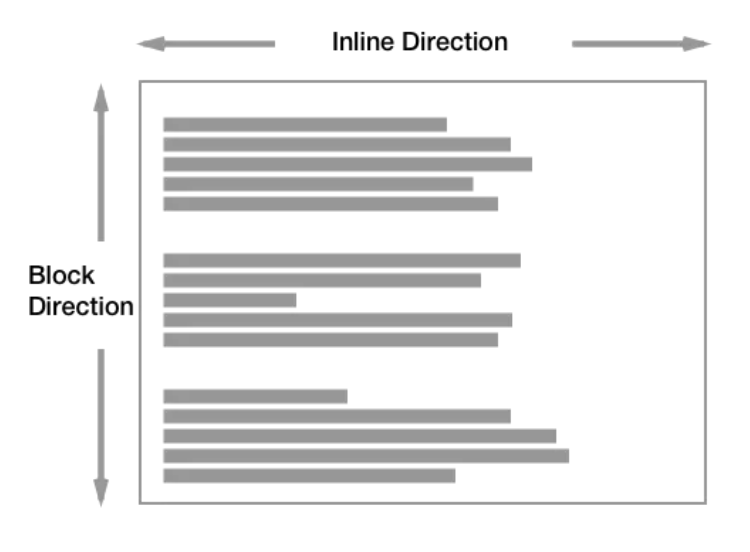

[>>>上一篇：HTML 问题分析思路](../../lib/HTML/HTML问题分析思路.md)

### 理解CSS
---

层叠样式表 — 也就是CSS — 是你在HTML之后应该学习的第二门技术。HTML用于定义内容的结构和语义，CSS用于设计风格和布局。比如，您可以使用CSS来更改内容的字体、颜色、大小、间距，将内容分为多列，或者添加动画及其他的装饰效果。

[>>菜鸟_CSS教程](https://www.runoob.com/css/css-tutorial.html)

#### CSS文档的后缀名
- .css

如果你打开一个没有用任何CSS来改变页面布局的网页，那么网页元素就会排列在一个正常流（normal flow）之中。在正常流中，元素盒子（boxes）会基于文档的写作模式（writing mode）一个接一个地排列。这就意味着，如果你的写作模式是水平方向的（句子是从左到右或从右到左书写），正常流会垂直地一个接一个排列页面的块级元素。  


#### CSS书写格式
```
  选择器: {
    属性1:值 单位;
    属性2:值 单位;
    ...
  }
```
>  

#### 组成要素
- 选择器通常是您需要改变样式的 HTML 元素。  
- 每条声明由一个属性和一个值组成。  
- 属性（property）是您希望设置的样式属性（style attribute）。每个属性有一个值。属性和值被冒号分开。  

[>>>简单的实例](https://www.runoob.com/try/demo_source/demo_default.htm)  
可以点开这个【简单的实例】，查看不同的CSS样式作用下，同一个画面不同的变化。


[>>CSS 属性列表](https://www.runoob.com/cssref/css-reference.html)  
[>>CSS 实例](https://www.runoob.com/css/css-examples.html)


HTML/CSS/JS 在线工具https://c.runoob.com/front-end/61

[>>>下一篇：CSS选择器](../../lib/CSS/CSS选择器.md)
