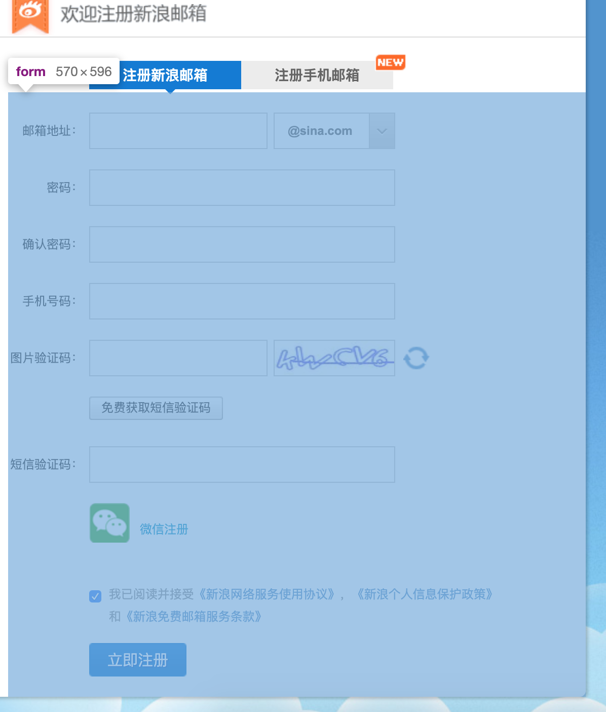
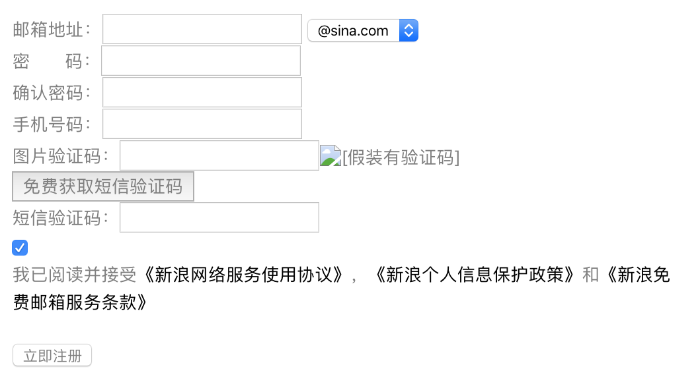

[>>>上一篇：HTML区块](../../lib/HTML/HTML区块.md)
### HTML表单
---
`<form>`标签。请先预读以下链接中的文章，再回过头来 展开一些内容。  
[>>HTML 表单](https://www.runoob.com/html/html-forms.html)
>**题外话：**  
随着JSP慢慢地要退出舞台，以往的通过form表单形式向服务端发送数据请求的方式，也逐渐地被淘汰了。但理解form标签的概念，还是必修课一样的存在。  
碰到老旧项目的维护工作，那还是避免不了学习JSP的，当然在有前端的基础上再去学习JSP也并非难事。

`<form>`内部是由输入元素等组成的。在网页中多用于表单形式的功能中，如注册账号，填写报告单等操作。一般这样的表格最下方都有一个`提交`的按钮。  
当点击其`提交`按钮后，用户填写的数据就像被封装到一个信封里，然后邮寄给服务端。又因为现实中网络通信速度很快，服务端可以立马回信告知结果。最后再通过js等技术将其结果显示到用户界面。

`<form>`标签其目的是用来向web 服务器提交信息，实现前后端的交互目的。  
下面这个新浪邮箱注册的页面中，注册信息都是通过`<form>`封装而成的。底部的`立即注册`按钮就是其`提交(submit)`按钮


（图1）

#### 将以上图片中的页面内容，简化成只有基础元属的代码：
```
<form method="POST" action="www.xxxxxx.com/register/regmail.php">
    邮箱地址：<input type="text" name="email">
    <select>
      <option value ="1">@sina.com</option>
    </select><br>
    密　　码：<input type="passWord" name="pwd"><br>
    确认密码：<input type="passWord" name="repwd"><br>
    手机号码：<input type="text" name="phonenumber"><br>
    图片验证码：<input type="text" name="imgvcode"><br>
    <button type="button">免费获取短信验证码</button><br>
    短信验证码：<input type="text" name="msgvcode"><br>
    <p>
        <input name="agreement" type="checkbox" id="agreement1" checked="">
        <label for="agreement1">我已阅读并接受<a href="https://login.sina.com.cn/signupagreement.html" target="_blank">《新浪网络服务使用协议》</a>，<a href="https://passport.sinaimg.cn/html/sso/privacyclause.html" target="_blank">《新浪个人信息保护政策》</a>和<a href="https://login.sina.com.cn/signupagreement_freemail.html" target="_blank">《新浪免费邮箱服务条款》</a></label>
    </p>
    <input type="submit" value="立即注册"/>
</form>
```
#### 运行结果：
><form method="POST" action="www.xxxxxx.com/register/regmail.php">
    邮箱地址：<input type="text" name="email">
    <select>
      <option value ="1">@sina.com</option>
    </select><br>
    密　　码：<input type="passWord" name="pwd"><br>
    确认密码：<input type="passWord" name="repwd"><br>
    手机号码：<input type="text" name="phonenumber"><br>
    图片验证码：<input type="text" name="imgvcode"><br>
    <button type="button">免费获取短信验证码</button><br>
    短信验证码：<input type="text" name="msgvcode"><br>
    <p>
        <input name="agreement" type="checkbox" id="agreement1" checked="">
        <label for="agreement1">我已阅读并接受<a href="https://login.sina.com.cn/signupagreement.html" target="_blank">《新浪网络服务使用协议》</a>，<a href="https://passport.sinaimg.cn/html/sso/privacyclause.html" target="_blank">《新浪个人信息保护政策》</a>和<a href="https://login.sina.com.cn/signupagreement_freemail.html" target="_blank">《新浪免费邮箱服务条款》</a></label>
    </p>
    <input type="submit" value="立即注册"/>
</form>

#### 解析：
```
<form method="POST" action="www.xxxxxx.com/register/regmail.php">
<form method="传送方式" action="服务器文件">
```
- action ：浏览者输入的数据被传送到的地方,比如一个PHP页面(save.php)。
- method ： 数据传送的方式(get/post),具体差别会在**《api接口》**里阐述说明

```
<form>
  ...
  <input type="输入类型" name="参数名" value="指定值"/>
  ...
</form>
```
- `<form>`标签内部主要由输入类型的元属组成。[>>输入元属](https://www.w3school.com.cn/html/html_form_input_types.asp)
- `<input>`标签用于搜集用户信息。
- 属性`参数名`在传输数据的过程中，会被当作该参数的名字。(详见下面的图片)
- 同时输入框中的`value`的`指定值`是根据当前页面中的输入值而改变的。

```
<form>
  ...
  <input type="submit" value="按钮名字"/>
</form>
```
- 提交(submit)也可以些作`<button type="submit">按钮名字</button>`
- 点击具有`提交(submit)`功能的按键，能往服务端传输数据。


当表单提交的时候，数据会被封装到`Form data`里，往`action`声明的url地址传输数据。  
关于`Form data`的封装结果，我们可以通过浏览器中的`开发者工具`查看其结果，可以参考下面这张图。  


（图2）  
这张图是新浪网官方注册邮箱时向服务端发送的数据，是将【图1】中的输入元素`<input type="输入类型" name="参数名" value="提交时的输入值">`一一封装到`Form data`中，传输给服务器统一处理。
```
Form data : {
  参数名 : 提交时的输入值,
  ...
}
```

[>>>下一篇：HTML 问题分析思路](../../lib/HTML/HTML问题分析思路.md)
