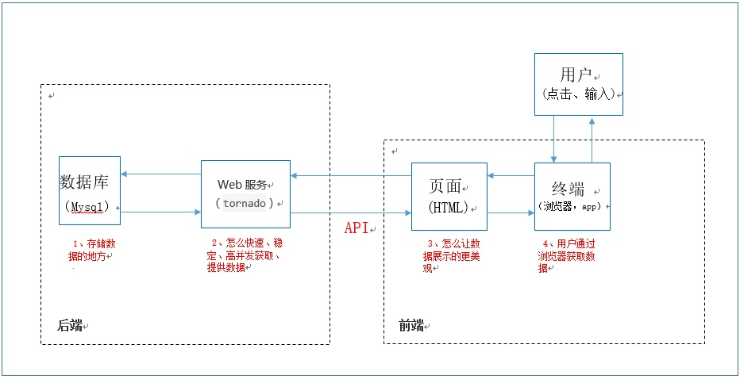
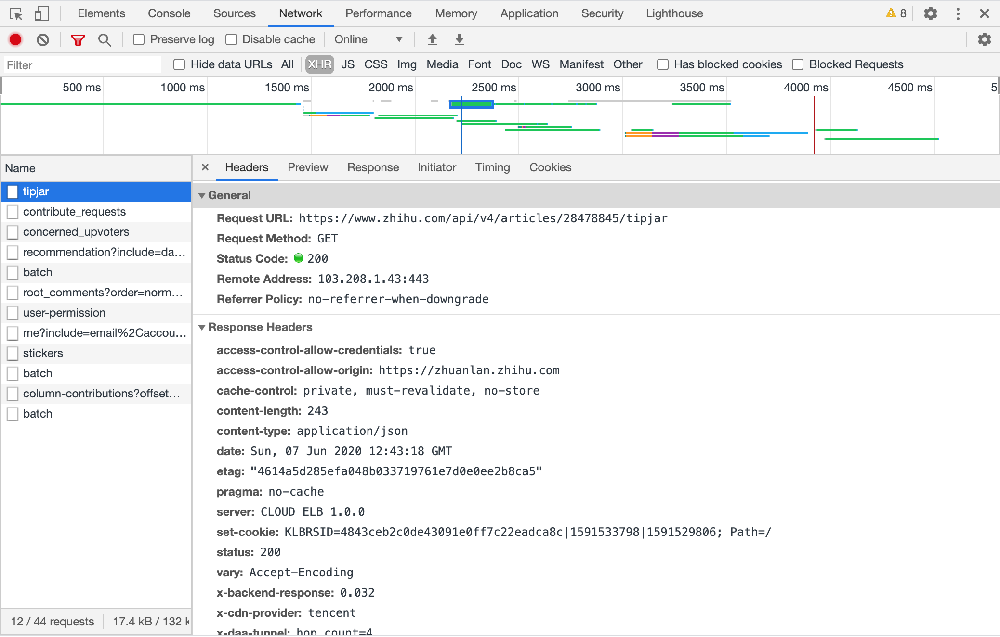

[>>>上一篇：jQuery 选择器](../../lib/JavaScript/jQuery选择器.md)

## jQuery异步请求AJAX
---
所有组成前端页面所需的要素，除了之前说明的各种HTML，css，js之外，还有个最重要的就是数据。将数据显示到页面上，才算是完成了前端工作的使命。  
前后端通信的流程可以参考下图。（从<用户>开始往下阅读）

   


[>>具体可以移步到《api接口》这一章节，理解前后端通信](../../lib/Server/api接口.md)

**AJAX**是**asynchronous javascript and XML**的简写，中文翻译是异步的javascript和XML，这一技术能够向服务器请求额外的数据而无须卸载页面，会带来更好的用户体验。虽然名字中包含**XML**，但**AJAX**通信与数据格式无关。  

**AJAX**包括以下几步骤：  
1. 创建AJAX对象；  
1. 发出HTTP请求；
1. 接收服务器传回的数据；  
1. 更新网页数据  

概括起来，就是一句话，ajax通过原生的**XMLHttpRequest对象**发出HTTP请求，得到服务器返回的数据后，再进行处理  

>**XMLHttpRequest对象**  
打开浏览器，按下F12(或者MAC的option＋command＋i)  
[Network]→[XHR]  
如下图，在[XHR]的标签底下，你可以看到所有该页面发送出去的AJAX请求，即XHR对象的内容。内容大致如下：  
- General（概要信息）
- Response Hearders（响应头）
- Request Hearders（请求头）
- Request Payload（请求体/POST请求的情况）
- Query String Parameters（参数/GET请求的情况）
**※关于这些信息的说明，详情参考《API接口》章节。**

   

**AJAX**是与服务器交换数据的技术之一，它在不重载全部页面的情况下，实现了对部分网页的更新。

就是客户端往服务端发送请求的一个手段，我们俗称其为发送请求。发送请求大致上分为两种情况：一、同步请求。二、异步请求。这里我们简单说明以下同步请求，着重了解异步请求。

### 同步请求
当浏览器向服务器发送同步请求时，服务处理同步请求的过程中，浏览器会处于等待的状态，服务器处理完请求把数据响应给浏览器并覆盖浏览器内存中原有的数据，浏览器——重新加载页面并展示服务器响应的数据。  

如下图是一个同步处理  
当选取完日期6.5，点击【再検索】发送请求的时候，等待接收到服务端传回来的结果后，整个页面需要重新刷新，重新渲染JSP之类的动态页面，然后将其结果显示在页面上。  

   

[>>トラベルコ查询机票——同步处理](https://www.tour.ne.jp/j_air)

### 异步请求
浏览器把请求交给代理对象—XMLHttpRequest（绝大多数浏览器都内置了这个对象），由代理对象向服务器发起请求，接收、解析服务器响应的数据，并把数据更新到浏览器指定的控件上。从而实现了页面数据的局部刷新。

如下图是一个异步处理，当发送请求的时候，不需要等待服务端传回来的结果，整个页面也不需要重新刷新，此时用户可以做任何操作。如果返回结果了，只需要通过JS技术，动态修改局部的HTML文档，做到只要局部刷新就能显示请求结果。  

   

[>>携程查询机票——异步处理](https://flights.ctrip.com/itinerary/roundtrip/bjs-sha)  

### 原生JS实现AJAX异步请求

#### 1.原生JS的GET
```
var xmlhttp = new XMLHttpRequest();
xmlhttp.open("GET","www.ajax.com/demo_get?param01=1&param02=lemon),true);
xmlhttp.send();
```
- 传递参数直接在?后指定，多个参数用&分隔
- GET请求同一URL时会有缓存

#### 2.原生JS的POST
```
var xmlhttp = new XMLHttpRequest();
xmlhttp.open("POST","www.ajax.com/demo_post",true);
xmlhttp.setRequestHeader("Content-type","application/x-www-form-urlencoded");
xmlhttp.send("param01=1&param02=lemon");
xmlhttp.onreadystatechange=function()
  {
  if (xmlhttp.readyState==4 && xmlhttp.status==200)
    {
    //doSomething...
    }
  }
```
- POST没有缓存
- POST发送的数据量大
- AJAX无法发送文件
- readyState改变时触发onreadystatechange事件，4为完成
- status是返回状态，200是成功，404是未找到页面
- responseText是返回的数据，为字符串格式

### JQUERY实现AJAX异步请求
#### 1.JQUERY的GET
```
$.ajax({
  type:"get",
  url:"www.ajax.com/demo_get",
  data: {
    param01=1,
    param02=lemon
  },
  dataType:"text",
  success: function (data) {
    //doSomething...
  }
});
```
- 传递参数直接在?后指定，多个参数用&分隔
- GET请求同一URL时会有缓存

#### 2.JQUERY的POST
```
$.ajax({
  type:"post",
  url:"www.ajax.com/demo_post",
  data: {
    param01=1,
    param02=lemon
  },
  dataType:"text",
  success: function (data) {
    //doSomething...
  },
  error: function (xhr,status,error) {
    console.log(error)
  }
});
```
`$.ajax([settings])`
其中参数settings为发送ajax请求时的配置对象，在该对象中，url表示服务器请求的路径，data为请求时传递的数据，dataType为服务器返回的数据类型，success为请求成功的执行的回调函数，type为发送数据请求的方式，默认为get。  
关于`参数settings`的说明可以参考[>>jQuery ajax() 方法](https://www.runoob.com/jquery/ajax-ajax.html)


[>>>下一篇：jQuery 特性](../../lib/JavaScript/jQuery特性.md)
