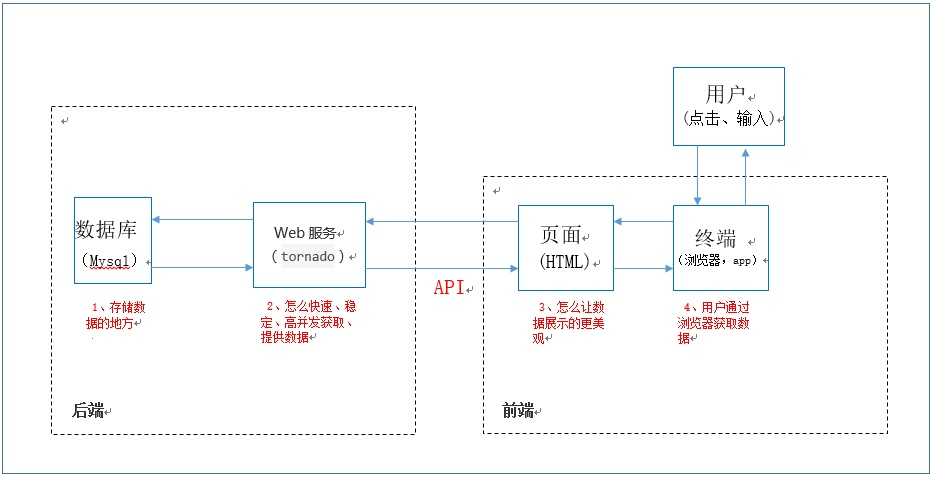

[>>>上一篇：jQuery 选择器](../../lib/JavaScript/jQuery选择器.md)

## jQuery异步请求AJAX
---
所有组成前端页面所需的要素，除了之前说明的各种HTML，css，js之外，还有个最重要的就是数据。将数据显示到页面上，才算是完成了前端工作的使命。  
前后端通信的流程可以参考下图。（从<用户>开始往下阅读）

   

[>>具体可以移步到《api接口》这一章节，理解前后端通信](../../lib/Server/api接口.md)

AJAX 是与服务器交换数据的技术，它在不重载全部页面的情况下，实现了对部分网页的更新。

就是客户端往服务端发送请求的一个手段，我们俗称其为发送请求。发送请求大致上分为两种情况：一、同步请求。二、异步请求。这里我们简单说明以下同步请求，着重了解异步请求。

### 同步请求
当浏览器向服务器发送同步请求时，服务处理同步请求的过程中，浏览器会处于等待的状态，服务器处理完请求把数据响应给浏览器并覆盖浏览器内存中原有的数据，浏览器——重新加载页面并展示服务器响应的数据。  

如下图是一个同步处理  
当选取完日期6.5，点击【再検索】发送请求的时候，等待接收到服务端传回来的结果后，整个页面需要重新刷新，然后将其结果显示在页面上。  

   

[>>トラベルコ查询机票——同步处理](https://www.tour.ne.jp/j_air)

### 异步请求
浏览器把请求交给代理对象—XMLHttpRequest（绝大多数浏览器都内置了这个对象），由代理对象向服务器发起请求，接收、解析服务器响应的数据，并把数据更新到浏览器指定的控件上。从而实现了页面数据的局部刷新。

如下图是一个异步处理，当发送请求的时候，不需要等待服务端传回来的结果，整个页面也不需要重新刷新，此时用户可以做任何操作。如果返回结果了，显示结果的局域，只要局部刷新就能显示结果。  

   

[>>携程查询机票——异步处理](https://flights.ctrip.com/itinerary/roundtrip/bjs-sha)  

[>>>下一篇：jQuery 特性](../../lib/JavaScript/jQuery特性.md)
