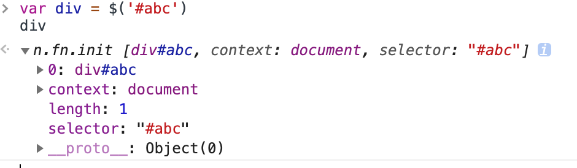
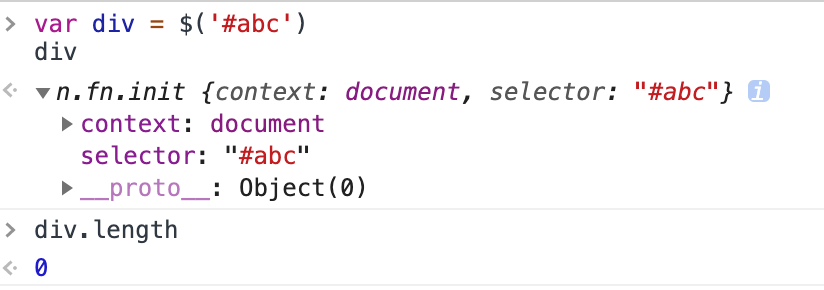

[>>>上一篇：了解 jQuery](../../lib/JavaScript/了解jQuery.md)

## jQuery选择器
---
jQuery 选择器允许您对 HTML 元素组或单个元素进行操作。  

首先通过选择器`$("<选择器>")`获取到该标签对象`object`，然后再通过jQuery赋予标签对象的方法，进行各种操作。  
例如：修改该标签的文本内容，`$("<选择器>").text("<修改的内容>");`  
**更多jQuery对象的方法，请查看以下官方API文档。**  
[>>查看此jQuery官方文档，可以修改属性](https://api.jquery.com/category/attributes/)  
[>>查看此jQuery官方文档，可以修改CSS样式](https://api.jquery.com/category/css/)  
[>>查看此jQuery官方文档，可以修改隐藏数据](https://api.jquery.com/category/data/)  

jQuery 选择器基于元素的 id、类、类型、属性、属性值等"查找"（或选择）HTML 元素。 它基于已经存在的 CSS 选择器，除此之外，它还有一些自定义的选择器。  
**jQuery的语法和CSS 选择器的语法类似，具体参考底下链接**  
[>>jQuery选择器__官方文档](https://api.jquery.com/category/selectors/)  
[>>jQuery选择器__菜鸟网文档](https://www.runoob.com/jquery/jquery-ref-selectors.html)  

### 简便性
为什么jQuery要发明选择器？回顾一下DOM操作中我们经常使用的代码：
```
// 按ID查找：<span id="dom-id">text</span>
var a = document.getElementById('dom-id');

// 按tag查找：<div>...</div>
var divs = document.getElementsByTagName('div');

// 查找<p class="red">：
var ps = document.getElementsByTagName('p');
// 过滤出class="red":

// 查找<table class="green">里面的所有<tr>：
var table = document.getElementsByTagName('table');
for (var i=0; i<table.children; i++) {
    // TODO: 过滤出<tr>
}
```
如果使用jQuery库的话,代码如下：
```
// 按ID查找：<span id="dom-id">text</span>
var a = $('#dom-id');

// 按tag查找：<div>...</div>
var divs = $('div');

// 查找<p class="red">：
// 过滤出class="red":
var ps = $('p.red');

// 查找<table class="green">里面的所有<tr>：
var table = $('table.green');
for (var i=0; i<table.children; i++) {
    // TODO: 过滤出<tr>
}
```

### jQuery对象
jQuery选择器的执行结果，返回的对象是jQuery对象。  
jQuery对象类似数组，它的每个元素都是一个引用了DOM节点的对象。
```
<div id="abc">...</div>

var div = $('#abc');
```
以上面的查找为例，如果id为abc的`<div>`存在，返回的jQuery对象如下：  
   
其中返回结果中有数组存在，`length`属性为1，且0角标就是`<div id="abc">...</div>`的**DOM对象**。
而整个返回结果为**jQuery对象**。
```
<div id="abc">...</div>

var div = $('#abc');

//DOM对象
div[0];
//修改其文本内容（对应使用的，就是DOM对象的方法）
div[0].innerHTML = "ABC";

//jQuery对象
div
//修改其文本内容（对应使用的，就是jQuery对象的方法）
div.text("ABC");
```
学过面向对象的同学都会知道，基于不同的对象，它们所拥有的方法也都不一样。  
虽然DOM对象和jQuery对象的功能性都差不多，都是用于操作标签对象。但是在决定使用对象类型之后，要使用相对应对象的方法来进行操作，切勿张冠李戴。

同时jQuery对象和DOM对象之间可以互相转化：
```
var div = $('#abc'); // jQuery对象
var divDom = div[0]; // 假设存在div，获取第1个DOM
var another = $(divDom); // 重新把DOM包装为jQuery对象
```

如果id为abc的`<div>`不存在，返回的jQuery对象如下：  
   
返回结果中没有没有数组存在，而且`length`属性为0。

总之jQuery的选择器不会返回undefined或者null，这样的好处是你不必在下一行判断if (div === undefined)。

---

jQuery成名很大一部分的原因就是因为其选择器的简便性，在书写速度能吊打原生JS。但如今JS也是在不断升级版本优化中，其中就出现了能代替jQuery选择器`$(<选择器>)`功能的`querySelector(<选择器>)`和`querySelectorAll(<选择器>)`，具体可以参考MDN官网文档资料  
[>>querySelector__MDN文档](https://developer.mozilla.org/zh-CN/docs/Web/API/Document/querySelector)

[>>>下一篇：jQuery异步请求AJAX](../../lib/JavaScript/jQuery异步请求AJAX.md)
