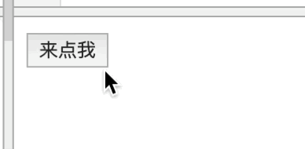

[>>>上一篇：js DOM对象](../../lib/JavaScript/jsDOM对象.md)

## jsDOM事件
---
DOM事件
Event 对象代表事件的状态，比如事件在其中发生的元素、键盘按键的状态、鼠标的位置、鼠标按钮的状态。  
HTML 事件可以是浏览器行为，也可以是用户行为。
##### 浏览器行为:
- 页面完成加载前
- 页面完成加载后
- 页面关闭
- 窗口尺寸调整

##### 用户行为:
- 鼠标移动(手机端的手指滑动)
- 滚动条滑动
- 点击
- 输入
- 按键


##### 事件定义方法：
```
<标签 属性="值" 事件="函数()">文本... </标签>
```
事件通常与函数结合使用，函数不会在事件发生前被执行！  

### 浏览器行为实例:
**比如：** 当页面加载后，判断用户登录与否  

  1. 声明该函数
  1. 在该函数内部书写判断方法
  1. 页面完成加载后事件中调用该函数  

```
<!DOCTYPE HTML>
<html>  
<head>  
  <title>Event</title>  
</head>
<!--页面完成加载后事件-->
<body onload="isLogin()">
  ...
</body>
</html>
```
```
//声明该函数
var isLogin() {
  //var loginFlg;
  //判断当前页面中，用户信息是否存在
  //是：已登录
  loginFlg = true;
  //否：未登录
  loginFlg = false;
  if(loginFlg) {
    //显示一个警告对话框,上面显示有指定的文本内容以及一个"确定"按钮。
    alert("用户已登录账号");
  } else {
    alert("请登录账号，或注册账号");
  }
}
```

### 用户行为实例:
**比如：** 当一个按钮被点击后，改变其按钮名称和背景颜色。  
```
<!DOCTYPE HTML>
<html>  
<head>  
  <title>Event</title>  
</head>
<body>
  <button id="btn" onclick="clickMe()">来点我</button>
</body>
</html>
```
```
function clickMe(){
  document.getElementById("btn").innerText ="点击成功";
  document.getElementById("btn").style.background = 'yellow'
}
```
   

通过捕获用户行为的方式，来达到动态修改html。根据不同的需求，使用不同的事件。所有的事件封装方法都如上所述，这里就不展开描述了，可以参考以下资料。

### 常见的HTML事件
|事件|	描述|
|---|---|
|onchange|	HTML 元素改变|
|onclick|	用户点击 HTML 元素|
|onmouseover|	用户在一个HTML元素上移动鼠标|
|onmouseout|	用户从一个HTML元素上移开鼠标|
|onkeydown|	用户按下键盘按键|
|onload|	浏览器已完成页面的加载|

[>>>HTML DOM 事件列表](https://www.runoob.com/jsref/dom-obj-event.html)


HTML/CSS/JS 在线工具https://c.runoob.com/front-end/61

[>>>下一篇：jsDOM监听器](../../lib/JavaScript/jsDOM监听器.md)
