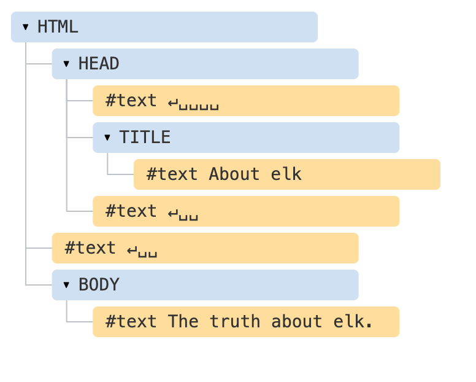
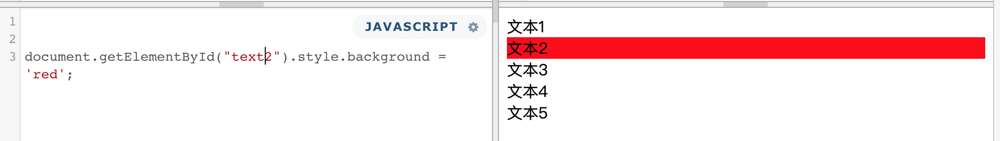
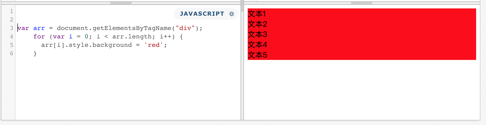

[>>>上一篇：js变量和函数](../../lib/JavaScript/js变量和函数.md)

## jsDOM对象
---
HTML 文档的主干是标签（tag）。

根据文档对象模型（DOM），每个 HTML 标签都是一个对象。嵌套的标签是闭合标签的`子标签(children)`。标签内的文本也是一个对象。  
*※DOM是DOCUMENT的缩写*

[>>菜鸟教程__HTML DOM](https://www.runoob.com/js/js-htmldom.html)

HTML DOM 模型被构造为对象的树：

### 一个HTML DOM 树例子：
   

JavaScript通过取得DOM对象，编辑该对象，来达到动态修改HTML文本内容的效果。  
- JavaScript 能够改变页面中的所有 HTML 元素
- JavaScript 能够改变页面中的所有 HTML 属性
- JavaScript 能够改变页面中的所有 CSS 样式
- JavaScript 能够对页面中的所有事件做出反应

所有这些对象都可以通过 JavaScript 来访问，我们可以使用它们来修改页面。  
**例如**，`document.body` 是表示 `<body>` 标签的对象。  
运行这段代码会使 <body> 变成红色状态:  
```
document.body.style.background = 'red'; // 将背景设置为红色
```
在这，我们使用了 `style.background` 来修改 `document.body` 的背景颜色，但是还有很多其他的属性，**例如**：
- innerHTML — 节点的 HTML 内容。
- offsetWidth — 节点宽度（以像素度量）
- etc...

### DOM 的例子
让我们从下面这个简单的文档（document）开始：
```
<!DOCTYPE HTML>
<html>  
<head>  
  <title>About elk</title>  
</head>
<body>
  The truth about elk.
</body>
</html>
```

DOM 将 HTML 表示为标签的树形结构。它看起来如下所示：  
  

每个树的节点都是一个对象。  
标签被称为 元素节点（或者仅仅是元素），并形成了树状结构：`<html>` 在根节点，`<head>` 和 `<body>` 是其子项，等。  
元素内的文本形成 文本节点，被标记为 `＃text`。一个文本节点只包含一个字符串。它没有子项，并且总是树的叶子。  
**例如**，`<title>` 标签里面有文本 "About elk"。

请注意文本节点中的特殊字符：
- 换行符：↵（在 JavaScript 中为 \n）
- 空格：␣

### 实例
下面这个例子，介绍几种常用方法。会通过各种方法来获取不同目标的DOM对象
```
<!DOCTYPE HTML>
<html>  
<head>  
  <title>About elk</title>  
</head>
<body>
  <div>文本1</div>
  <div id="text2">文本2</div>
  <div class="text3">文本3</div>
  <div class="text3" name="text4">文本4</div>
  <div name="text4">文本5</div>
</body>
</html>
```
- **getElementById**  
    getElementById() 方法可返回对拥有指定 ID 的第一个对象的引用。  
    `document.getElementById("text2")`能获取到以下内容，(规范文本中id是唯一的)返回结果唯一：
    ```
    <div id="text2">文本2</div>
    ```

- **getElementsByTagName**  
    getElementsByTagName() 方法可返回带有指定标签名的对象的集合。  
    `document.getElementsByTagName("div")`能获取到以下内容，返回结果为array数组：
    ```
    <div>文本1</div>
    <div id="text2">文本2</div>
    <div class="text3">文本3</div>
    <div class="text3" name="text4">文本4</div>
    <div name="text4">文本5</div>
    ```

- **getElementsByClassName**  
    getElementsByClassName() 方法返回文档中所有指定类名的元素集合。因为`class`是可以复用的。  
    `document.getElementsByClassName("text3")`能获取到以下内容，返回结果为array数组：
    ```
    <div class="text3">文本3</div>
    <div class="text3" name="text4">文本4</div>
    ```


- **getElementsByName**  
    getElementsByName() 方法可返回带有指定名称的对象的集合。因为`name`是可以复用的。  
    `document.getElementsByName("text4")`能获取到以下内容，返回结果为array数组：
    ```
    <div class="text3" name="text4">文本4</div>
    <div name="text4">文本5</div>
    ```

### 修改DOM 对象的属性
通常我们获取到 目标对象后，会对该目标进行文本，属性做修改。  
**比如：**将以上获取到的对象的背景色进行一个修改的话。  
运行以下简单的代码：
- **getElementById**
    ```
    document.getElementById("text2").style.background = 'red';
    ```
       
- **getElementsByTagName**  
    ```
    //因为返回值是数组
    //所以document.getElementsByTagName("div").style.background = 'red';
    //是无法作用的，需要遍历循环处理
    var arr = document.getElementsByTagName("div");
    for (var i = 0; i < arr.length; i++) {
      arr[i].style.background = 'red';
    }
    ```
       
- **getElementsByClassName**  
    同上

- **getElementsByName**  
    同上

HTML/CSS/JS 在线工具https://c.runoob.com/front-end/61

[>>>下一篇：jsDOM事件](../../lib/JavaScript/jsDOM事件.md)
