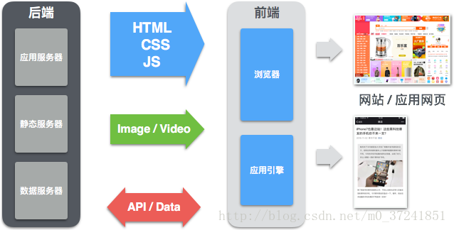

### 概述
 在古代，所有的信息数据管理都是通过账簿来记录管理，当需要查找某一条信息的时候，更是只能通过肉眼来翻阅查找。而现如今我们有了强大的信息管理系统，只要敲开键盘输入就能记录。同样的在查找的时候，以电脑运算的速度来讲，更是快捷方便。自动化和数字化都是现代信息技术的一大特点。
现在生活中也都离不开手机app，浏览的网页，PC软件，银行ATM，车站取票机等等。这些看得见摸得着,可任由用户自行操作一个个画面的东西，都有一个泛称"前端",即能在终端设备上做任何输入以及操作的。

----
下面有几个重要的概念

- ##### 终端设备(Computer terminal)
  终端是一台电脑或者计算机系统，用来让用户输入数据，及显示其计算结果的机器。终端有些是全电子的，也有些是机电的。就是一个硬件。
  上述例子中的终端机器就有手机，电脑，AMT机，取票机。其中最普遍存在的还是手机和电脑，在生活中这种终端还有很多种，应对各个的行业的生产服务需求，都会产生各种类型的终端机器。当然，有了机器还不够，为了提高使用他的人的用户体验或效率，甚至会开发加入有更直观的操作界面的软件或网页。
- ##### 前端(Client)
  前端就是客户端，面向客户的。就是一个软件程序，但是是针对用户的一种程序软件。
  在有了终端平台之后，服务厂商为了更好地向市场推广以及提供自家服务，又加入了一个前端。这是面向用户的一个产品。他可以是一个下载安装的软件，或一个直接访问的一个网页。
  打个比方，阿里的飞猪是一个旅游出行网络交易服务平台。作为用户，我们能搜得到的飞猪产品有网页版，PC客户端，IOS客户端，Android客户端，微信小程序客户端，支付宝小程序客户端。这么多产品都属于前端。
  互联网的快速发展和激烈竞争，用户体验成为一个重要的关注点，所以有能力的大公司会大力发展他们的客户端类型，来吸引不同使用习惯的用户。

  **常见的客户端有以下几种**
|客户端OS版|  开发语言  |
| ---- | ---- |
|网页版|  html,css,js  |
|windwows版|  C/C++  |
|Mac版|  Object-c  |
|IOS版|  Object-c/html,css,js  |
|Android版|  java/html,css,js  |
|微信小程序版|  html,css,js  |
|支付宝小程版|  html,css,js  |
- ##### 后端(Server)
  后端就是服务端，是服务客户端的一个程序。  
  原则上来讲，服务端是不具备运算能力，因为服务端同时会与多个客户端建立连接，一旦服务端进行运算的话，就会占用大量的资源，从而影响到其他客户端的通信。通常来讲运算逻辑都要写在客户端中，服务端都只具备认证与传输数据功能。  

  因为服务端是为该产品所有的客户端服务的，所以服务的内容诸如向客户端提供资源，保存客户端数据。
  ###### ※打个比方，微博的服务器服务所有的微博客户端，他接受所有客户端发来的请求，然后将内容反馈给客户端。
|用户行为|客户端发起的请求|服务端的处理|服务端的响应|客户端接收结果|
| ---- | ---- | ---- |---- |---- |
|用户输入账号登录|发送账号和密码信息|认证账号密码是否正确|反馈验证结果|正确即登录，错误即报错|  

  也可以将服务端视为用户和数据库之间的一座桥梁。  
  因为数据库的保密性和安全性，所以在此之外需要一个数据库管理员，即服务器。  
  为了避免用户可以随意地修改数据，而只允许用户操作其权限以内的行为。所以在服务端，一般都要做认证处理和权限管理处理，认证完毕后执行其请求。

   编写完成的服务端程序，是需要部署在相应的服务器平台上。启动该程序后，在不断电的情况下，就可以处理通过互联网局域网发来的请求。

   **常的服务器部署环境有以下几种**  
     1. Apache服务器
     1. Nginx服务器
     1. Tomcat服务器
     1. Weblogic服务器

- ##### 数据库(DataBase)
顾名思义，就是一个用来存储电子数据的一个仓库。
可视为电子化的文件柜——存储电子文件的处所，用户可以对文件中的数据运行新增、截取、更新、删除等操作。

  **常见的数据库有以下几种**  
|名称|类型|
| ---- | ---- |
|MySQL|关系型数据库|
|Oracle|关系型数据库|
|SQL Server|关系型数据库|
|DB2|关系型数据库|
|Postgres|关系型数据库|
|SQLite|关系型数据库 （多见于手机app）|
|Redis|非关系型数据库 （NoSQL）|
---
俗称的前台，后台，指的都是具体页面。  
前台，是用户直接能看到的页面，所有人都可以访问。  
后台，是有权限的运营人员或特殊用户（比如淘宝卖家）用权限登陆后才看得到的页面，除了能看到其他人看不到的报表外，在后台还能修改前台显示给用户看的内容。

以上说到的终端，前端，后端，数据库之间的协作通信关系，可以参考以下的图片。

(需改)

建议在学习了编程语言基础后，再往下阅读。

[>>>下一篇关于前端](../lib/关于前端.md)
